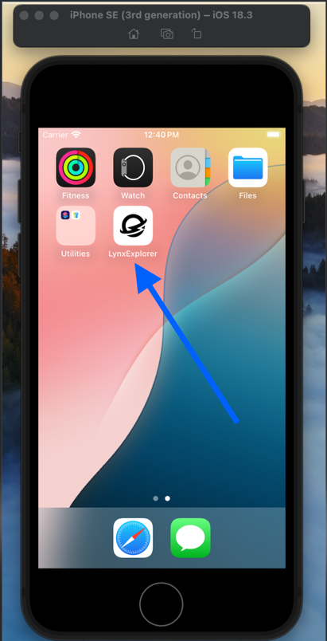
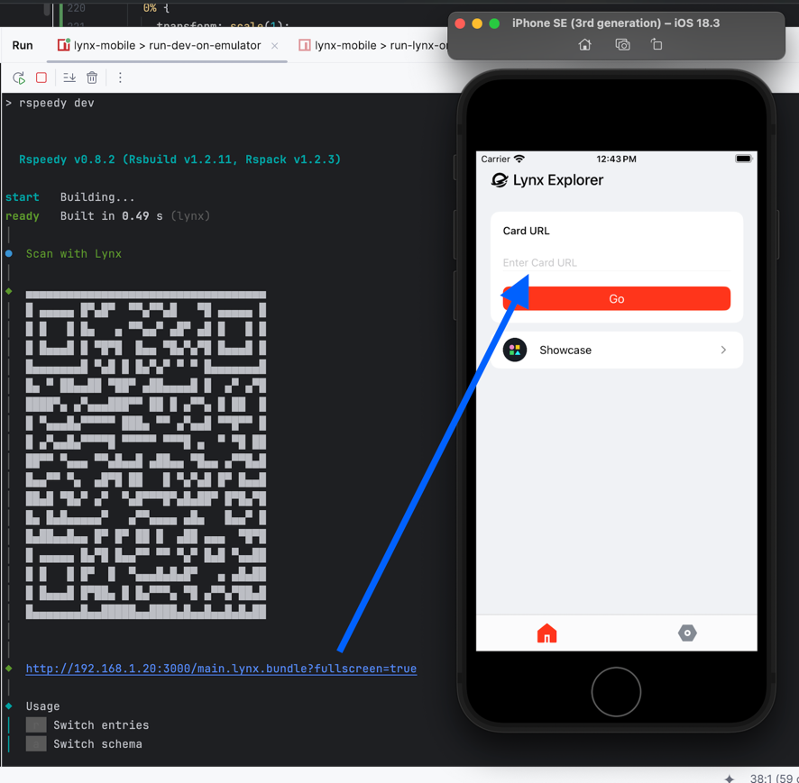
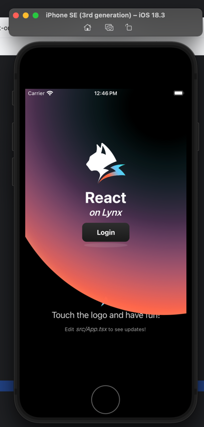

# skeleton LynxJS app
This is a _ReactLynx_ ios project bootstrapped with `create-rspeedy` (Rust-based build system).

## Getting Started
-------------------------------
-------------------------------
_pre reqs;_
* latest version of Xcode
* at least one iOS simulator

* PNPM (i installed it via corepack + homebrew)
* https://formulae.brew.sh/formula/pnpm
* https://pnpm.io/installation#using-corepack
`pnpm init`
`corepack enable pnpm`

* [Download LynxExplorer that works with your CPU- default for this app is Apple m-series chips (ARM)](https://lynxjs.org/guide/start/quick-start.html#ios-simulator-platform=macos-arm64,explorer-platform=ios-simulator)

-------------------------------
-------------------------------

### First, install the dependencies:

```bash
pnpm install
```

### Running the Emulator
Run the following command to ensure the iOS emulator boot script is executable:
- cd into the repo and run
  ```bash 
  chmod +x scripts/boot-ios-emulator.cjs`
  ```
- **(Why is this needed?**
      -This command grants execute permissions to the _boot-ios-emulator.cjs_ script, allowing it to run directly from the terminal. If you only run it via node, this step is not required.)

Now, start the development environment:

```bash pnpm run run-dev-on-emulator ```

- After running the above command, copy the generated URL and paste it into the Lynx Explorer app (running in your ios emulator) to see the src/App.tsx view in the emulator.
# 




You can start editing the page by modifying `src/App.tsx`. The page auto-updates as you edit the file.
